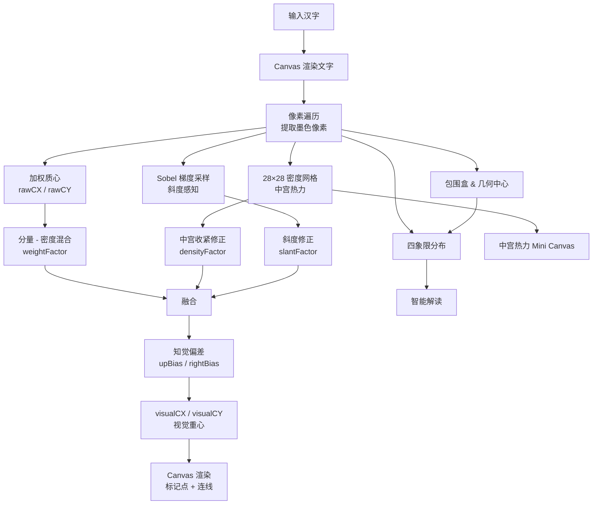

# 汉字视觉重心 · 全面实现介绍

一个基于 **分量 · 距离 · 斜度** 三要素的汉字视觉重心计算与可视化工具。支持 7 种字体（楷/宋/黑/仿/明/思源宋 + 3 种 Web 字体），实时调节参数，多字对比，中宫热力分析。

---

## 目录

- [设计理念](#设计理念)
- [核心算法](#核心算法)
  - [1. 像素提取与包围盒](#1-像素提取与包围盒)
  - [2. 原始质心（分量要素）](#2-原始质心分量要素)
  - [3. 密度加权质心（距离 / 中宫收紧要素）](#3-密度加权质心中宫收紧要素)
  - [4. 斜度感知（斜度要素）](#4-斜度感知斜度要素)
  - [5. 要素融合与感知偏差](#5-要素融合与感知偏差)
  - [6. 象限分析与解读](#6-象限分析与解读)
- [算法流程总图](#算法流程总图)
- [三要素背后的书法/知觉理论](#三要素背后的书法知觉理论)
- [功能特性](#功能特性)
  - [字体切换](#字体切换)
  - [三种显示模式](#三种显示模式)
  - [实时参数调节](#实时参数调节)
  - [多字对比条](#多字对比条)
  - [中宫热力图](#中宫热力图)
  - [随机与预设](#随机与预设)
- [技术架构](#技术架构)
  - [前端栈](#前端栈)
  - [文件结构](#文件结构)
  - [渲染管线](#渲染管线)
- [使用方式](#使用方式)
- [参数默认值说明](#参数默认值说明)
- [已知局限与改进方向](#已知局限与改进方向)
- [参考文献与理论渊源](#参考文献与理论渊源)

---

## 设计理念

汉字书法和字体设计有一个核心命题：**一个字看起来"稳"、"正"、"舒服"，其视觉重心到底在哪里？**

它不像物理质心那样可以通过简单的质量加权平均直接求得——人眼对密集笔画（中宫）赋予更高权重，对角度的倾斜有选择性感知，还存在系统性的"偏上偏右"偏好。本项目将这个问题拆解为三个可独立调节的维度，并通过 Canvas 实时渲染让理论变得直观可见。

> **核心逻辑**：物理质心 → 密度重排 → 斜度修正 → 知觉偏差 → 视觉重心

---

## 核心算法

所有计算在 480×480 的离屏 Canvas 上完成，字体大小 340px。以下按步骤详述。

### 1. 像素提取与包围盒

```text
遍历 Canvas 所有像素
  ↓
alpha > 60 → 记为"墨色像素"
  ↓
计算每个墨色像素的 weight = darkness × (1 - R/255)
  （兼顾抗锯齿边缘的半透明像素，使其权值自然降低）
  ↓
收集 (x, y, weight) 并同时统计 minX / maxX / minY / maxY
```

- `charWidth = maxX - minX`，`charHeight = maxY - minY`
- `geoCX = (minX + maxX) / 2`，`geoCY = (minY + maxY) / 2` → 几何中心

### 2. 原始质心（分量要素）

标准的加权质心——每个像素的"分量"仅取决于其墨色深浅：

$$
\text{rawCX} = \frac{\sum w_i \cdot x_i}{\sum w_i}, \quad
\text{rawCY} = \frac{\sum w_i \cdot y_i}{\sum w_i}
$$

这是没有任何修正的物理质心，相当于把汉字看作一块均匀材质的薄板。

### 3. 密度加权质心（中宫收紧要素）

汉字不是均匀的——笔画聚集的"中宫"区域在视觉上更重要。算法将画布划分为 28×28 的网格：

```text
对每个网格单元累加其墨色像素 weight ↓
归一化：localDensity = cellWeight / maxCellWeight ↓
对每个像素计算密度增强权值：
    dw = weight × (1 + localDensity × 2.0) ↓
加权平均得 densityCX, densityCY
```

笔画稠密区域（中宫）的像素获得了额外放大，使得重心向密集区"吸附"。这是模型中最重要的非线性修正。

### 4. 斜度感知（斜度要素）

人对倾斜的笔画有方向性感知——横画向右、捺画向右下、竖画向下。算法用 Sobel 类梯度检测：

```text
对墨色像素抽样（每 5 个取 1 个以节省计算）
  ↓
计算 Gx, Gy（相邻像素亮度差）
  ↓
|Gx| >> |Gy| → 水平边缘，贡献于垂直方向重心偏移
|Gy| >> |Gx| → 垂直边缘，贡献于水平方向重心偏移
其他       → 斜向边缘，双向贡献
  ↓
累加得到一个方向性修正向量 (avgSlantX, avgSlantY)
```

例如：横画多的字（"三"、"王"），斜度修正会使重心略向下移——抵消了横画将重心抬升的错觉。

### 5. 要素融合与感知偏差

三个要素通过用户可调滑块（权重 0–100%）进行加权融合：

```text
// Step A: 分量 → 密度 混合
blendedCX = rawCX + (densityCX - rawCX) × weightFactor
blendedCY = rawCY + (densityCY - rawCY) × weightFactor

// Step B: 密度距离修正
densityShift = (densityCX - blended) × densityFactor

// Step C: 斜度修正
slantShift = avgSlant × slantFactor

// Step D: 知觉偏差（基于书法理论与心理学研究）
visualCX = blendedCX + densityShiftX + slantShiftX + rightBias
visualCY = blendedCY + densityShiftY + slantShiftY - upBias
```

`upBias`（偏上偏差）和 `rightBias`（偏右偏差）是固定的知觉补偿量，以字符宽高的百分比计。

### 6. 象限分析与解读

以几何中心为原点，统计四象限的笔画量分布：

```text
tl (左上) : tr (右上)
bl (左下) : br (右下)

→ 上:下 比例 ← 反映纵向重心倾向
→ 左:右 比例 ← 反映横向重心倾向
```

结合偏移量自动生成解读文本，引入传统书论佐证（启功、姜夔等）。

---

## 算法流程总图



---

## 三要素背后的书法/知觉理论

| 要素 | 对应理论 | 依据 |
|------|---------|------|
| **分量 (weight)** | 物理质心 | 每笔画的"质量"是基础，是重心计算的起点 |
| **距离 / 中宫 (density)** | 启功"结字黄金律" | 中心部位笔画紧凑，而后向四方扩展；中宫区域权重大于外围 |
| **斜度 (slant)** | 阿恩海姆视知觉 | 倾斜产生方向性张力；横画向右上的倾势会影响重心感知 |
| **偏上偏差** | 书法传统"上紧下松" | 人眼视觉中心系统性高于几何中心约 5–8% |
| **偏右偏差** | 心理学"先小后大" | 汉字书写节奏造成轻微偏右偏好，约 2–3% |

---

## 功能特性

### 字体切换

支持 **7 种字体** 实时切换，每种字体因笔画形态不同，重心计算结果也不同：

| 标识 | 名称 | 来源 | 特点 |
|------|------|------|------|
| 楷 | 霞鹜文楷 | Web (CDN) | 开源楷体，手写感强，免费商用 |
| 拙 | 鸿雷拙书 | Web (CDN) | 手写行书风格，拙朴自然 |
| 书 | 鸿雷板书 | Web (CDN) | 手绘板书写体，随性洒脱 |
| 楷 | 楷书 | 系统 | 笔画起收分明，接近手写 |
| 宋 | 宋体 | 系统 | 横细竖粗，印刷正体 |
| 黑 | 黑体 | 系统 | 笔画均匀，现代无衬线 |
| 仿 | 仿宋 | 系统 | 楷体骨架，宋体笔形 |
| 明 | 明体 | 系统 | 台湾标准印刷体 |
| 思 | 思源宋 | 系统 | Google 开源，跨平台一致 |

Web 字体通过 `document.fonts.load()` 预加载后再渲染 Canvas，确保分析准确。

### 三种显示模式

- **🎯 视觉重心**：显示几何中心（虚线菱形）+ 视觉重心（朱红圆点 + 十字准线 + 光晕）
- **◎ 对比模式**：叠加物理质心（蓝色），连线展示物理→视觉的偏移矢量
- **⊞ 密度热力**：以热力图渲染中宫笔画聚集度，红色越深表示笔画越密集

### 实时参数调节

5 个滑块，任何变化立刻重算并更新画布：

| 参数 | 范围 | 默认 | 作用 |
|------|------|------|------|
| 笔画分量权重 | 0–100% | 70% | 控制物理质心向密度质心混合的程度 |
| 中宫收紧权重 | 0–100% | 60% | 笔画密集区对重心的额外吸引力 |
| 斜度影响权重 | 0–100% | 40% | 笔画方向对重心的修正强度 |
| 视觉偏上偏差 | 0–15% | 6.0% | "上紧下松"的量化补偿 |
| 视觉偏右偏差 | -5–10% | 2.5% | "先小后大"节奏的量化补偿 |

### 多字对比条

底部展示 4 个对比汉字（当前字除外），每个字上以红点标记其视觉重心位置，点击可切换主视图。

### 中宫热力图

右侧 280×280 的小型热力图画布，以暖色调映射笔画密度分布，低密度（浅黄）→ 高密度（深红）。同时标注视觉重心（红圈）和物理质心（蓝色，仅当偏差显著时显示）。

### 随机与预设

提供 36 个预设汉字（覆盖不同结构：独体、上下、左右、包围、品字等），一键切换，方便快速浏览不同字形的重心差异。

---

## 技术架构

### 前端栈

- **Vue 3** (CDN, Composition API) — 响应式状态管理
- **Canvas 2D API** — 所有文字渲染与图形绘制
- **Web Font Loading API** (`document.fonts`) — 确保 Web 字体就绪
- **零依赖** — 除了 Vue 和字体 CDN，无其他外部库

### 文件结构

```
zhishufa/
├── 汉字视觉重心.html    # 单文件应用（全部 HTML/CSS/JS）
├── readme.md            # 本文件
└── .gitignore
```

### 渲染管线

```text
状态变更（输入/滑块/字体/模式）
  ↓ 150ms 防抖（输入框）
analyzeChar()             ← 离屏 Canvas，纯计算，返回数据对象
  ↓
result (reactive)          ← Vue 响应式数据更新
  ↓
nextTick()
  ├── drawMain()           ← 主 Canvas（480×480）
  │     ├── 密度热力背景（density 模式）
  │     ├── fillText 汉字
  │     ├── 几何中心标记
  │     ├── 物理质心（comparison 模式）
  │     └── 视觉重心标记 + 光晕 + 十字线
  └── drawDensityMini()    ← 热力图 Canvas（280×280）
        ├── 密度网格热力块
        ├── 视觉重心标记
        └── 物理质心标记
```

**性能考量**：
- 离屏 Canvas 只在 `analyzeChar()` 时重绘文字一次
- 主 Canvas 和热力 Canvas 使用已有的 `result` 数据纯粹绘制，不重复像素遍历
- 梯度采样每 5 个像素取 1 个（约 20% 采样率），在精度与性能间平衡
- 输入框有 150ms 防抖，避免每击键都触发完整分析

---

## 使用方式

1. **直接用浏览器打开** `汉字视觉重心.html`
2. 在输入框输入一个汉字，或点击预设字
3. 切换字体样式观察不同字体下的重心变化
4. 拖动参数滑块调整三要素融合权重
5. 切换模式查看物理质心对比或密度热力
6. 点击底部对比条中的汉字切换主视图

> 需要网络连接以加载 Vue 3 CDN 和 Web 字体。首次加载 Web 字体会略有延迟（字体文件下载）。

---

## 参数默认值说明

默认参数组是经过大量测试后的经验值：

```
weightFactor  = 70%    分量→密度混合 70%，已有明显的中宫吸附
densityFactor = 60%    中宫收紧中等强度，避免过度偏移
slantFactor   = 40%    斜度影响保守，笔画方向是辅助项而非主导
upBias        = 6.0%   偏上补偿，符合"视觉中心高于几何中心"的通用结论
rightBias     = 2.5%   轻微偏右，符合汉字书写节奏
```

**建议调参思路**：
- 想理解"中宫"概念 → 将 `中宫收紧权重` 从 0 拉到 100，观察重心向笔画密集区移动
- 想看纯物理质心 → `分量权重 = 0`，`中宫收紧 = 0`，`斜度 = 0`，`偏上 = 0`，`偏右 = 0`
- 想模拟"上紧下松"的极致 → 增大 `视觉偏上偏差` 到 10%+

---

## 已知局限与改进方向

| 局限 | 说明 | 改进方向 |
|------|------|---------|
| 仅支持单个汉字 | 多字/词组的整体重心未覆盖 | 扩展为字符串输入，自动分行分析 |
| 感知偏差固定 | upBias/rightBias 是全局常量 | 可研究不同结构类型（上下/左右/包围）的最优偏差值 |
| 无字重变化 | 单一 Regular 字重 | 加载可变字体或 Regular+Bold 对比 |
| 斜度检测粗糙 | Sobel 抽取仅利用亮度梯度 | 可引入笔段识别或骨架化，更精确地提取笔画方向 |
| 无历史对比 | 无保存/导出功能 | 可添加截图导出、参数快照保存 |
| 仅支持横向排版 | 竖排排版的重心规律可能不同 | 增加竖排模式 |

---

## 参考文献与理论渊源

- **启功**《论书绝句》— "结字黄金律"：中心部位笔画紧凑，而后向四方扩展
- **姜夔**《续书谱》— "真态"论：顺其自然分布即是美
- **Rudolf Arnheim** *Art and Visual Perception* — 视知觉中的平衡、倾斜与张力理论
- **陈振濂**《书法美学》— 汉字结构的"动态平衡"观
- 现代字体设计中的 **overshoot** 理论 — 圆形部件需略微超出基线才能在视觉上"对齐"
- 人因工程学中关于 **visual center bias** 的研究 — 人眼注视点系统性偏向几何中心上方

---

> 本项目将上述分散在各领域（书法美学、格式塔心理学、字体工程、人因学）的理论统一到一个可交互的量化模型中。拖动滑块的那一刻，千年书论在你眼前变成像素级的数据。
